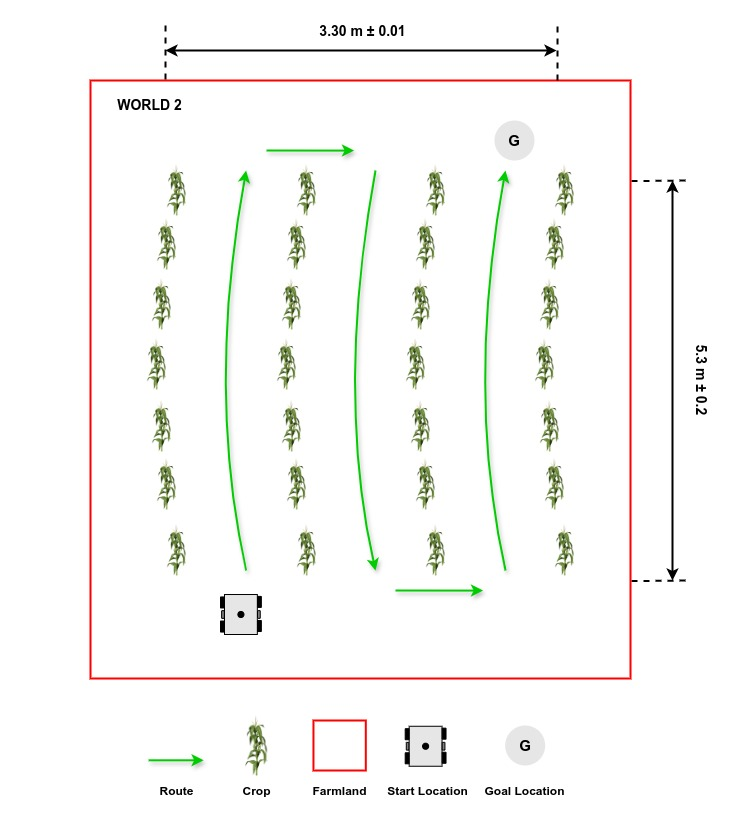

# Piste D'autonomie

## Description Générale


Les robots agricoles doivent être capables de se déplacer à travers les cultures et les terres agricoles, notamment en se déplaçant de manière autonome dans les rangs de maïs sur terrain accidenté. Cette tâche consiste à atteindre l'extrémité d'un rang, à effectuer un virage et à revenir dans les rangs adjacents jusqu'à l'objectif. Les équipes doivent développer un logiciel pour guider le robot le long d'un [chemin prédéfini](#explorer-plusieurs-mondes) au sein des rangs, de sa position de départ à son objectif.

## Instructions pour la tâche

### Lancement de la tâche
Dans un nouveau terminal, exécutez le fichier de lancement suivant pour lancer le robot dans Gazebo et RViz :

```sh
ros2 launch parc_robot_bringup task_launch.py
```

Vous devriez voir l'affichage ci-dessous dans Gazebo et RViz respectivement. À droite, le robot et à gauche, le cercle vert qui représente l'emplacement cible.

=== "Gazebo"
    

=== "RViz"
    

### Explorer Plusieurs Mondes

Nous avons préparé trois mondes que vous pouvez utiliser pour développer votre solution, chacun ayant une disposition et une longueur de ligne différentes.

=== "Monde 1"
    

=== "Monde 2"
    

=== "Monde 3"
    


La route par défaut est `world1`, mais vous pouvez sélectionner les deuxième et troisième options de route (`world2` et `world3`) en passant l'argument dans la commande `ros2 launch` comme suit :

```sh
## monde2
ros2 launch parc_robot_bringup task_launch.py ​​world:=world2

## monde3
ros2 launch parc_robot_bringup task_launch.py ​​world:=world3
```

### Préparer votre Solution

* Votre solution doit être préparée sous forme de packages ROS à enregistrer dans votre dossier de solutions. Créez un fichier exécutable de nœud dans votre package ROS qui exécute TOUT le code nécessaire à votre solution. Nommez ce fichier : `task_solution.py`.

* Par conséquent, votre solution doit être exécutée en appelant les commandes suivantes :

Dans un terminal :

```sh
ros2 launch parc_robot_bringup task_launch.py
```

Ou

```sh
ros2 launch parc_robot_bringup task_launch.py ​​world:=world2
```

Ou

```sh
ros2 launch parc_robot_bringup task_launch.py ​​world:=world3
```

!!! note
    Veuillez patienter jusqu'à ce que les modèles du monde et du robot soient générés. Ce processus peut prendre plus de temps que d'habitude, surtout lors de la première exécution du programme.

Dans un autre terminal:

```sh
ros2 run <le-nom-de-votre-colis> task_solution.py>
```

Les fichiers de lancement peuvent également être utilisés dans votre solution.

## Règles de Tâche

* * Le temps limite pour terminer la tâche pour **chaque** monde est de **10 minutes (600 secondes)**.

* La tâche est terminée UNIQUEMENT lorsqu'UNE partie du robot se trouve à l'intérieur du cercle vert (marqueur d'emplacement de l'objectif) après avoir suivi le chemin prédéfini comme indiqué ci-dessus.

## Évaluation de l'autonomie

La notation de cette tâche repose sur les critères suivants :

| S/N | Critères/Indicateurs | Description |
| ----------- | ----------- | ------- |
| 1 | **Chemin prédéfini** | Suivez le chemin comme expliqué dans [Description du monde](#explorer-plusieurs-mondes). |
| 2 | **Évitement des plantes** | Le robot doit éviter tout contact avec les plants de maïs. **(Moins de contact, c'est mieux)** |
| 3 | **Distance finale jusqu'à l'objectif** | Distance la plus courte entre le robot (mesurée depuis son centre) et l'objectif à travers les rangs de culture, calculée à la limite de temps [12 minutes] **(Plus petite, mieux c'est)**
| 4 | **Temps de réalisation** | Temps écoulé entre le lancement de la solution et la réalisation de la tâche **(Plus petite, mieux c'est)** |
