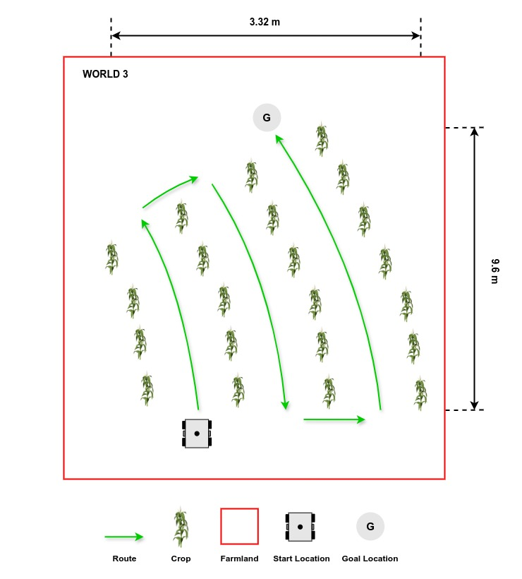

# Autonomy Track

## General Description


Agricultural robots must be able to navigate through crops and farmland, which includes autonomously moving through rows of maize plants on rough terrain. This task involves reaching the end of a row, making a turn, and returning in adjacent rows until the goal location is reached. Teams must develop software to guide the robot through a [pre-defined path](#exploring-multiple-worlds) within the crop rows, from its starting position to the goal location.

## Task Guidelines

### Launching the Task
In a new terminal, run the following launch file to bring up the robot in Gazebo and RViz:

```sh
ros2 launch parc_robot_bringup task_launch.py
```

You should see the display below in Gazebo and RViz respectively. To the right, there's the robot and to the left is the green circle which represents the goal location.

=== "Gazebo"
    

=== "RViz"
    

### Exploring Multiple Worlds
We have prepared three worlds you can use as you develop your solution with each world having different row layouts and row lengths.

=== "World 1"
    

=== "World 2"
    

=== "World 3"
    


The default route is `world1`, but you can select the second and third route option (`world2` and `world3`) by passing the argument in the `ros2 launch` command as follows:

```sh
## world2
ros2 launch parc_robot_bringup task_launch.py world:=world2

## world3
ros2 launch parc_robot_bringup task_launch.py world:=world3
```

### Preparing your Solution
* Your solution should be prepared as ROS packages to be saved in your solution folder. Create a node executable file in your ROS package which runs ALL the code you need in your solution. Name this node file: `task_solution.py`.

* Hence, your solution should be run by calling the following commands:

In one terminal:

```sh
ros2 launch parc_robot_bringup task_launch.py
```

Or 

```sh
ros2 launch parc_robot_bringup task_launch.py world:=world2
```

Or

```sh
ros2 launch parc_robot_bringup task_launch.py world:=world3
```

!!! note "Note"
    Please wait until both the world and robot models have finished spawning. This process may take longer than usual, especially when running the program for the first time.

In another terminal:

```sh
ros2 run <your-package-name> task_solution.py>
```

Launch files can also be used in your solution.

## Task Rules

* The time limit to complete the task for **each** world is **10 minutes (600 seconds)**.

* The task is ONLY complete when ANY part of the robot is inside the green circle (goal location marker) after following the pre-defined path as shown above.

## Autonomy Evaluation

Scoring for this task would be based on the following criteria:

| S/N      | Criteria/Metric | Description |
| ----------- | ----------- | ------- |
| 1  | **Pre-defined path** | Follow the path as explained in [World Description](#exploring-multiple-worlds). |
| 2  | **Plant avoidance**  | The robot should avoid making contact with the maize plants. **(Less contact is better)** |
| 3 | **Final travel distance to goal** | Shortest travel distance from robot (measured from robot center) through the crop rows to the goal which is calculated at the time limit [12 minutes] **(Smaller is better)**
| 4  | **Completion time** | Time from launching the solution to task completion **(Smaller is better)** |
