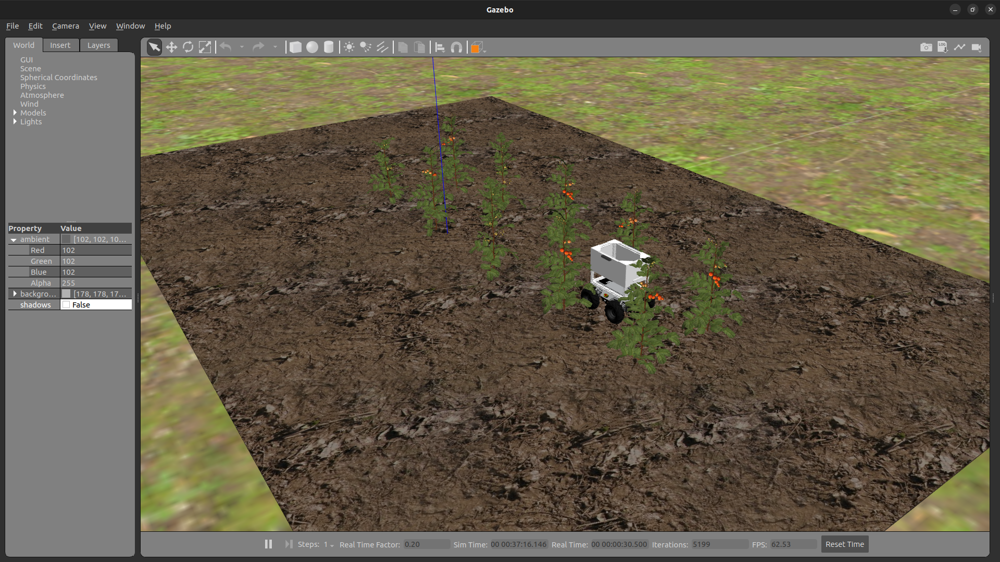

# Tâche 2: Estimation du rendement des cultures


## Description générale
Selon les Nations Unies, la population mondiale devrait atteindre 8,5 milliards d’habitants d’ici 2030, l’Afrique étant le continent à la croissance la plus rapide. Cette croissance démographique projetée rend nécessaire l’urgence d’assurer la sécurité alimentaire. L'estimation précise des rendements des cultures est un aspect essentiel de la quête de la sécurité alimentaire et des robots agricoles autonomes sont utilisés dans cette entreprise.

Pour cette tâche, le robot PARC est conduit de manière autonome à travers deux rangées de plants de tomates et les équipes doivent développer un logiciel permettant d'estimer le rendement du champ de tomates en utilisant les caméras RVB et la vision par ordinateur du robot.

## Lignes directrices sur les tâches

### Lancer la tâche

Dans un nouveau terminal, exécutez le fichier de lancement suivant pour faire apparaître le robot dans Gazebo et RViz:

```bash
ros2 launch parc_robot_bringup task2_launch.py
```

Vous devriez voir l'affichage ci-dessous dans Gazebo et RViz respectivement.

=== "Gazebo"
    

=== "RViz"
    

Il existe trois mondes pour cette tâche, chaque monde variant en termes de nombre de plants de tomates produisant des fruits. Le monde par défaut est `world1` et similaire à la tâche 1, les options du deuxième et du troisième monde, `world2` et `world3`, peuvent être sélectionnées en passant l'argument dans la commande de `ros2 launch` ci-dessous:

```bash
## world2
ros2 launch parc_robot_bringup task2_launch.py world:=world2

## world3
ros2 launch parc_robot_bringup task2_launch.py world:=world3
```

Le robot commence à se déplacer une fois que les nœuds appelés par le fichier de lancement ont été chargés avec succès.

Pour publier le nombre de fruits dans un monde choisi, vous devez utiliser le sujet `/parc_robot/crop_yield` qui utilise le message personnalisé 
`parc_robot_interfaces/msg/CropYield` du package `parc_robot_interfaces`.

L'extrait de code ci-dessous montre comment un simple éditeur du sujet et du message personnalisé est créé et utilisé:

```python
#!/usr/bin/env python3

import rclpy
from rclpy.node import Node
from parc_robot_interfaces.msg import CropYield


class YieldTest(Node):
    def __init__(self):
        super().__init__("yield_test")
        self.yield_pub = self.create_publisher(CropYield, "/parc_robot/crop_yield", 1)
        timer_period = 0.5  # secondes
        self.timer = self.create_timer(timer_period, self.timer_callback)
        self.i = 1

    def timer_callback(self):
        msg = CropYield()

        # Attribuer la variable de compteur i aux données du message de rendement des cultures
        msg.data = self.i

        # Publier un message
        self.yield_pub.publish(msg)

        # Enregistrer les informations sur la console
        self.get_logger().info("Current crop yield is: %d" % msg.data)

        # Variable du compteur d'incréments
        self.i += 1


def main(args=None):
    rclpy.init(args=args)

    yield_test = YieldTest()
    rclpy.spin(yield_test)

    yield_test.destroy_node()
    rclpy.shutdown()


if __name__ == "__main__":
    main()
```
Cette ligne importe le message dans le nœud:

```python
from parc_robot_interfaces.msg import CropYield
```

Un nouveau sujet appelé `/parc_robot/robot_status` a été ajouté pour publier l'état actuel du robot. Le type de message pour cette rubrique est `std_msgs/String`, 
qui indique si le robot a commencé à se déplacer le long de l'itinéraire ou a terminé l'itinéraire désigné. L'état du robot a deux valeurs possibles: **"started"** et **"finished"**.

Nous vous recommandons de jouer avec les différents mondes des champs de tomates pour vous assurer que votre solution est robuste dans différents mondes.

### Installer OpenCV
Pour cette tâche, il est recommandé d'utiliser [OpenCV](https://opencv.org/){target=_blank} pour la vision par ordinateur. Ce package peut être installé en exécutant cette commande dans une fenêtre de terminal:

```bash
sudo apt install python3-opencv
```

### Se déplacer à des vitesses différentes
Le robot peut se déplacer à différentes vitesses. La vitesse par défaut est de `0.1 m/s`, mais vous pouvez modifier la vitesse en passant l'argument dans la commande `ros2 launch` comme suit:

```bash
## 0.25 m/s
ros2 launch parc_robot_bringup task2_launch.py speed:=0.25
```
De même, nous vous recommandons de jouer avec cette plage de vitesses: `[0.25, 0.5, 0.75, 1.0]`, pour garantir que votre solution est robuste à différentes vitesses.

### Attentes de la tâche

L'objectif de la tâche est de compter le nombre de tomates rouges lorsque le robot se déplace entre les deux rangées de plants de tomates. Lorsque le robot atteint la fin 
de la rangée, il s'arrêtera et vous devrez publier le nombre total de tomates rouges dans le sujet `/parc_robot/crop_yield`.

Il est important de noter que la publication en temps réel des tomates comptées n’est pas nécessaire. Vous pouvez publier le nombre de 
tomates après l'arrêt du robot, que vous pouvez surveiller via la rubrique ``parc_robot/robot_status`.

### Préparer votre Solution

* Votre solution doit être préparée sous forme de packages ROS à enregistrer dans votre dossier de solution. Créez un fichier exécutable de nœud dans votre 
    package ROS qui exécute TOUT le code dont vous avez besoin dans votre solution. Nommez ce fichier de nœud : `task2_solution.py`.

* Afin d'utiliser le message personnalisé CropYield dans votre solution, la dépendance `parc_robot_interfaces` est ajoutée dans le fichier `package.xml` de votre package de solution:
    
    ```xml
    <depend>parc_robot_interfaces</depend>
    ``` 
* Par conséquent, votre solution à la tâche 2 doit être exécutée en appelant les commandes suivantes:

    Dans un terminal:

    ```sh
    ros2 launch parc_robot_bringup task2_launch.py
    ```

    Ou 

    ```sh
    ros2 launch parc_robot_bringup task2_launch.py world:=world2
    ```

    Ou

    ```sh
    ros2 launch parc_robot_bringup task2_launch.py world:=world3
    ```

    !!! note "Note"
        Please wait until both the world and robot models have finished spawning. This process may take longer than usual, especially when running the program for the first time.

    Dans un autre terminal:

    ```sh
    ros2 run <your-package-name> task2_solution.py 
    ```

## Règles de Tâche

* Assurez-vous de publier UNE SEULE FOIS sur le sujet `/parc_robot/crop_yield`, ET à la FIN de l'exécution. L'exécution se termine lorsque le robot envoie terminé sur le sujet `/parc_robot/robot_status`.

* Vous n'êtes pas autorisé à publier sur le sujet `/robot_base_controller/cmd_vel_unstamped`. Le robot sera conduit à travers le champ par la simulation Gazebo. 
    Vous êtes uniquement autorisé à publier sur le sujet `/parc_robot/crop_yield`.

* Vous devez publier le nombre de tomates dans le champ dans le sujet `/parc_robot/crop_yield` au plus tard 5 secondes après l'arrêt du robot.


## Évaluation des Tâches
Votre solution sera testée sur trois nouveaux mondes de champs de tomates et à des vitesses variées. Un score total pour cette tâche sera calculé à l'aide de la formule ci-dessous:

```python
total_score = W1*accuracy(speed_1) + ... + Wn*accuracy(speed_n)

```
où,

***speed_n*** - c'est la vitesse à laquelle le robot se déplace `m/s`

***accuracy*** - est calculé comme le pourcentage d'erreur moyen des 3 mondes à une vitesse particulière
     
***Wn*** - est le poids sur le terme de précision qui varie avec la vitesse

En considérant `world1` par exemple,

```
Nombre réel de tomates rouges = 60
Prédit nombre de tomates rouges = 54
Erreur absolue = |60 - 54| = 6
Pourcentage d'erreur = (Erreur absolue / Nombre réel de tomates rouges) * 100
Pourcentage d'erreur = 10%
```

Le pourcentage d’erreur moyen est le pourcentage d’erreur dans les 3 mondes.
