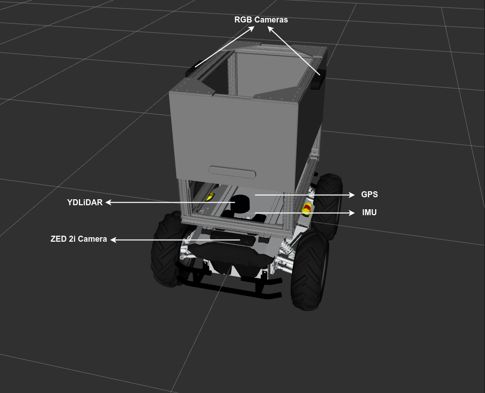

# Introduction

Dans cette phase de simulation uniquement, les équipes travailleront à la conception de solutions en fonction du parcours de simulation choisi.

## Piste D'autonomie

La plateforme de simulation utilisée pour ce parcours est [Gazebo Harmonic](https://gazebosim.org/docs/harmonic/install_ubuntu/). Les équipes doivent développer, tester et soumettre un logiciel pour piloter de manière autonome **PARC AgRobot** dans les champs de maïs.

Les packages ROS 2 du **PARC AgRobot** et les modèles d'environnement Gazebo (voir description ci-dessous) sont mis à disposition des équipes pour leur permettre de développer et de tester leurs solutions (voir [Dépôt GitHub](https://github.com/PARC-Robotics/PARC2025-Engineers-League)).

### Le PARC AgRobot

Le PARC AgRobot est un véhicule terrestre sans pilote (UGV) équipé de différents capteurs pour vous aider à atteindre vos objectifs. Ces capteurs sont :

* **YDLiDAR:** Un capteur lidar situé en haut de la base du robot. Le Ydlidar publie le sujet `/scan`.

* **RGB Camera (x2):** Deux caméras RVB latérales sont installées à gauche et à droite du robot. Suspendues à un surplomb, elles offrent une vue aérienne des terres agricoles. Les sujets publiés par ces caméras sont nommés « /left_camera/ » et `/right_camera/`.

* **ZED 2i Camera:** Il s'agit d'une caméra stéréo située à l'avant de la base du robot. Elle publie tous les sujets `/zed2/`, y compris les données de nuages ​​de points (`/zed2/point_cloud/cloud_registered`).

* **GPS:** Pour la localisation, nous avons fourni un capteur GPS qui simule un GNSS (système satellite de navigation global). Il publie le sujet `/gps/fix`.

* **IMU :** Un capteur IMU est ajouté à la base et publié sur le sujet `/imu`.

La figure ci-dessous montre l'agrobot avec des capteurs étiquetés.

### Environnement de simulation

L'environnement de simulation utilisé dans cette phase est modélisé comme une terre agricole réaliste avec un terrain accidenté et des plants de tomates fruitiers.

## Piste de Conception

Les équipes doivent concevoir un outil de fertilisation à intégrer au **PARC AgRobot**. Les spécifications de conception de l'outil sont disponibles sur [cette page](../phase-1/design-track.fr.md).