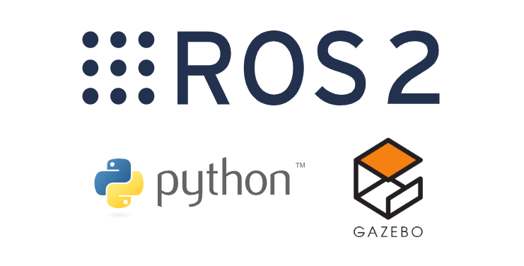

# En passant avec ROS

Le [Robot Operating System](https://www.ros.org/about-ros/) (ROS) est un framework flexible pour le développement de logiciels robotiques. Il s'agit d'un ensemble d'outils, de bibliothèques et de conventions visant à simplifier la création de comportements robotiques complexes et robustes sur une grande variété de plateformes robotiques.

Nous avons organisé ce concours autour de ROS en raison de ses fonctionnalités et de son utilisation répandue dans la recherche et l'industrie robotiques. La version utilisée pour le concours de cette année est **ROS 2 Jazzy** et utilise Python. Cependant, si votre équipe maîtrise mieux C++, vous pouvez l'utiliser à la place.

Que vous soyez un développeur ROS 2 débutant ou plus avancé, nous vous recommandons de prendre le temps de consulter les didacticiels ROS 2 Jazzy suivants, en particulier la section débutant.

* [Tutoriels officiels ROS 2](https://docs.ros.org/en/jazzy/Tutorials.html){target=_blank}
* [Jazzy - Premiers pas avec ROS 2](https://www.youtube.com/playlist?list=PLNWNEEf8BvG6z60R4r9_wQ6Ekmqj-BmFr){target=_blank}
* [Cours BME MOGI - ROS](https://github.com/MOGI-ROS){target=_blank}
!!! note
    Votre expérience d'apprentissage globale dans ce concours dépend **fortement** de votre maîtrise des concepts fondamentaux de ROS 2 dès le début. Par conséquent, nous vous recommandons **fortement** de consacrer du temps à l'utilisation de ces ressources.

Voyons maintenant comment configurer votre espace de travail ROS 2 pour le concours.