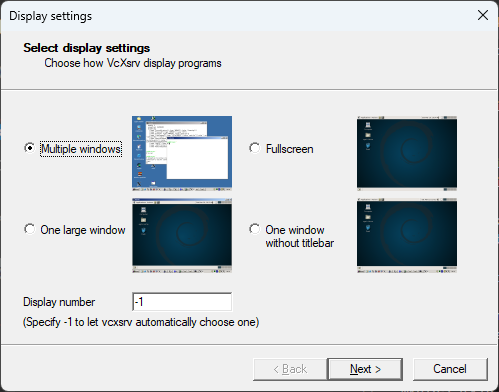
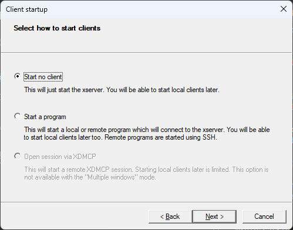
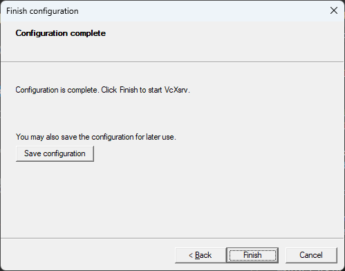
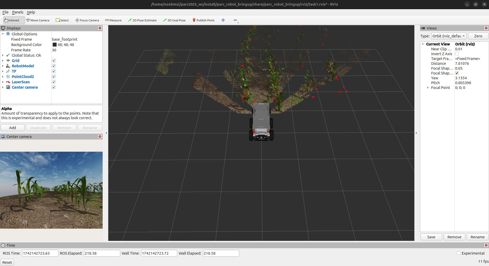

# Configurer votre PC avec Docker sous Windows

Ce guide vous guidera tout au long du processus de configuration d'un environnement Ubuntu et d'un espace de travail ROS sur votre PC Windows à l'aide de Docker, ce qui vous permettra de développer et de tester facilement vos projets ROS dans un environnement conteneurisé. Nous expliquerons également comment connecter VS Code au conteneur Docker et comment utiliser X11 pour exécuter des applications GUI Docker.

!!! avertissement "Remarque"
     Ce guide est conçu pour les personnes qui envisagent d'utiliser l'image Docker. Si vous souhaitez configurer votre PC et votre espace de travail sur une machine hôte, veuillez consulter les instructions fournies dans [Configurer votre espace de travail](../getting-started-tutorials/setting-up-your-workspace.md).

## Conditions préalables
Avant de commencer les étapes ci-dessous, assurez-vous que vous disposez des éléments suivants :

* [Docker Desktop](https://docs.docker.com/desktop/install/windows-install/#install-docker-desktop-on-windows){target=_blank} pour Windows installé et en cours d'exécution
* [Code Visual Studio](https://code.visualstudio.com/download){target=_blank} (Code VS) installé
* [Git](https://git-scm.com/book/en/v2/Getting-Started-Installing-Git){target=_blank} installé

## Étape 1 : Installez VcXsrv

1. Téléchargez et installez [VcXsrv](https://sourceforge.net/projects/vcxsrv/){:target=_blank} sur votre ordinateur.
2. Installez VcXsrv en exécutant le programme d'installation et en suivant les invites.
3. Une fois l'installation terminée, ouvrez le VcXsrv en cliquant sur le menu Démarrer et en tapant "XLaunch".
4. Dans la fenêtre XLaunch, sélectionnez l'option `Plusieurs fenêtres` et cliquez sur `Suivant`.
     
5. Dans la fenêtre suivante, sélectionnez l'option `Démarrer aucun client` et cliquez sur `Suivant`.

     

6. Dans la fenêtre suivante, sélectionnez l'option "Presse-papiers" et cliquez sur "Suivant". Désélectionnez l'option `Native opengl` et sélectionnez l'option `Disable access control`.
     
7. Dans la fenêtre suivante, cliquez sur "Terminer".
     

## Étape 2 : Création du dossier principal et de `docker-compose.yml`

1. Créez un nouveau dossier à votre emplacement préféré et nommez-le comme vous le souhaitez.
2. Dans le dossier nouvellement créé, créez un espace de travail ROS en exécutant la commande suivante dans powershell :

     ``` coquille
     mkdir catkin_ws/src
     ```

3. Ensuite, créez un fichier `docker-compose.yml` dans le dossier principal. Ce fichier contiendra la configuration de notre conteneur ROS Docker. Ouvrez le fichier dans votre éditeur préféré et ajoutez les lignes suivantes :

     ``` yaml
     version : '3.8'
     prestations de service:
       rose :
         image : parcengineersleague/parc-2023
         environnement:
           - AFFICHAGE=host.docker.internal:0.0
           - ROS_HOSTNAME=ros
           - ROS_MASTER_URI=http://ros:11311
         tomes :
           - ./catkin_ws:/catkin_ws
         ports :
           - "11311:11311"
         commande : roscore
     ```
     Cette configuration extraira l'image officielle de PARC 2023, si elle n'existe pas déjà, et la configurera pour la prise en charge du serveur X11. Il montera également le dossier `catkin_ws` à l'intérieur du conteneur et lancera la commande `roscore` au démarrage du conteneur.

4. Enregistrez le fichier `docker-compose.yml` et fermez votre éditeur.

## Étape 4 : Construire le conteneur Docker

1. Ouvrez une nouvelle fenêtre de terminal et accédez au dossier principal que vous avez créé précédemment.

2. Exécutez la commande suivante pour créer le conteneur Docker :

     ``` coquille
     docker composer -d
     ```

3. Une fois le conteneur créé, vous pouvez vérifier qu'il est en cours d'exécution en exécutant la commande suivante :

     ``` coquille
     docker ps
     ```

     Vous devriez voir la sortie suivante :

    ```shell
    CONTAINER ID   IMAGE                          COMMAND                  CREATED          STATUS          PORTS                    NAMES
    db7df0798d9b   osrf/ros:noetic-desktop-full   "/ros_entrypoint.sh …"   20 seconds ago   Up 19 seconds    0.0.0.0:11311->11311/tcp   parc-ros-docker-ros-1
    ```


## Étape 5 : Ouvrir un terminal dans le conteneur Docker

1. Pour ouvrir un terminal dans le conteneur Docker, exécutez la commande suivante :

     ```shell
     docker exec -it parc-ros-docker-ros-1 bash
     ```
     où `parc-ros-docker-ros-1` est le nom du conteneur. Vous pouvez trouver le nom du conteneur en exécutant la commande `docker ps`.

2. Une fois le terminal ouvert, vous pouvez vérifier que vous êtes dans le conteneur en exécutant la commande suivante :

     ```shell
     echo $ROS_DISTRO
     ```

     Vous devriez voir la sortie suivante :

     ```shell
     noetic
     ```
     Cela signifie que vous êtes dans le conteneur et que la distribution ROS est définie sur Noetic.

## Étape 6 : Tester l'installation

Si vous avez terminé les tâches précédentes avec succès, vous devriez pouvoir exécuter cette commande de lancement ROS et voir le simulateur Gazebo et le simulateur RViz s'ouvrir avec l'affichage suivant :
```sh
roslaunch parc_robot task2.launch
```

Fenêtre du simulateur de belvédère



Fenêtre RViz

Vous devez `publier`/écrire dans le `sujet` `/cmd_vel` pour déplacer le robot.
Dans l'étape suivante, vous apprendrez à contrôler le robot manuellement à l'aide de votre clavier. Une fois que vous avez testé cela, vous pouvez suivre le guide [Commencer avec ROS](../getting-started-with-ros) pour apprendre à écrire un programme pour contrôler le robot.

## Étape 7 : Contrôler le robot à l'aide du clavier
Exécutez la commande suivante dans un nouveau terminal
```sh
source ~/catkin_ws/devel/setup.bash
roslaunch parc_robot teleop.launch
```

Maintenant, en gardant le deuxième terminal en haut (teleop.launch), appuyez sur `i` pour faire avancer le robot, vous pouvez voir le robot se déplacer dans les fenêtres "RViz" et "Gazebo".
vous pouvez utiliser les touches ci-dessous pour déplacer le robot et la touche "k" pour arrêter le mouvement.
```sh
Se déplacer :
   u    i    o
   j    k    l
   m    ,    .
```

## Étape 8 : Développer à l'intérieur du conteneur avec VSCode

1. Installez l'extension [Dev Containers](https://marketplace.visualstudio.com/items?itemName=ms-vscode-remote.remote-containers) dans VSCode.

2. Cliquez sur l'icône verte dans le coin inférieur gauche de la fenêtre VSCode et sélectionnez "Ouvrir le dossier dans le conteneur...".

3. Sélectionnez le dossier `catkin_ws`.

4. VSCode va maintenant ouvrir le dossier `catkin_ws` à l'intérieur du conteneur.

5. Vous pouvez maintenant utiliser VSCode pour modifier les fichiers dans le dossier `catkin_ws`.

Alternativement, puisque nous avons déjà créé un volume pour le dossier `catkin_ws`, vous pouvez également utiliser votre éditeur préféré pour modifier les fichiers dans le dossier `catkin_ws` sur votre machine hôte. Les modifications seront reflétées à l'intérieur du conteneur. L'avantage d'utiliser VSCode dans le conteneur est que vous pouvez utiliser le terminal intégré pour exécuter des commandes à l'intérieur du conteneur.