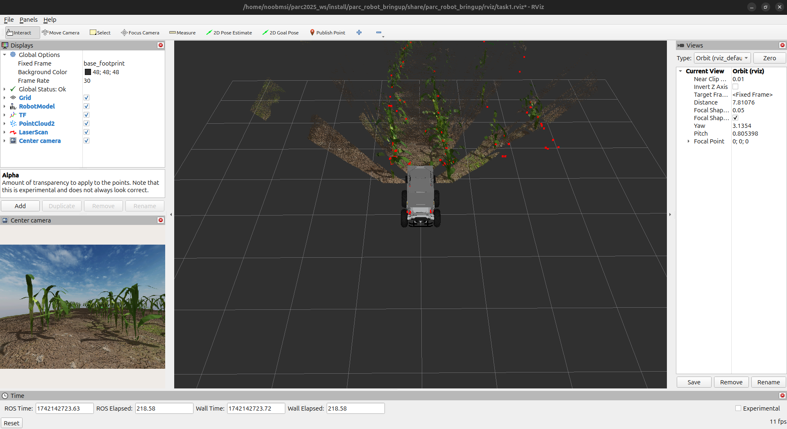

# Comment configurer votre espace de travail

Dans ce tutoriel, vous allez configurer un répertoire sur votre PC équipé de ROS 2 comme espace de travail pour le développement et installer les packages ROS 2 du concours. Veuillez suivre attentivement les instructions ci-dessous.

!!! note
     Ceci peut être effectué UNIQUEMENT après avoir configuré votre PC (en suivant le tutoriel ici : [Configuration de votre PC](../getting-started-tutorials/setting-up-your-pc.fr.md)).

<!-- uncommment once we have docker setup -->
<!-- !!! note -->
<!--      Si vous utilisez un conteneur Docker, vous pouvez ignorer ce didacticiel et suivre les instructions de [Configuration de votre PC à l'aide de Docker](../getting-started-tutorials/setting-up-with-docker.md) à la place. -->

## Étape 1: Configurer l'espace de travail ROS 2

Ouvrez un nouveau terminal sur votre PC, puis copiez-collez les lignes suivantes :
```sh
mkdir -p ~/ros2_ws/src
cd ~/ros2_ws/src
```

## Étape 2: Cloner le dépôt

Dans le même terminal (ou un nouveau), copiez-collez les lignes suivantes :
```sh
cd ~/ros2_ws/src
git clone https://github.com/PARC-Robotics/PARC2024-Engineers-League.git .
```

## Étape 3: Installer les dépendances

Le dépôt du projet cloné contient des paquets ROS nécessitant certaines dépendances avant de pouvoir être utilisés. Ces dépendances sont spécifiées dans le fichier « package.xml » de chaque paquet et sont installées à l'aide de [rosdep](https://docs.ros.org/en/jazzy/Tutorials/Intermediate/Rosdep.html){target=_blank}, un utilitaire en ligne de commande permettant d'identifier et d'installer les dépendances pour compiler ou installer un paquet.

Pour installer les dépendances du projet, dans le même terminal (ou un nouveau), copiez-collez ce qui suit :
```sh
cd ~/ros2_ws
sudo rosdep init
rosdep update
rosdep install --from-paths src --ignore-src --rosdistro jazzy -r -y
```

## Étape 4 : Compiler les paquets

L'étape suivante consiste à compiler les paquets installés à l'aide de `colcon build` :
```sh
cd ~/ros2_ws
colcon build
```

## Étape 5 : Configurer l’environnement ROS 2
La commande suivante doit être exécutée à chaque ouverture de terminal pour accéder aux commandes ROS 2 :

```sh
source /opt/ros/jazzy/setup.bash
```

Pour éviter de sourcer le fichier d’installation ROS à chaque ouverture de terminal, vous pouvez ajouter la commande à votre script de démarrage en exécutant ces lignes :

```sh
echo "source /opt/ros/jazzy/setup.bash" >> ~/.bashrc
source ~/.bashrc
```

L’espace de travail `ros2_ws` est une **superposition** de l’installation ROS, appelée **sous-couche**. De même, pour utiliser les exécutables ou les bibliothèques de paquets dans `ros2_ws`, l’espace de travail doit être source à chaque ouverture de terminal avec cette commande :

```sh
source ~/ros2_ws/install/setup.bash
```

De même, pour éviter de sourcer manuellement l'espace de travail à chaque nouveau terminal lancé, la commande peut également être ajoutée au script de démarrage du shell :

```sh
echo "source ~/ros2_ws/install/setup.bash" >> ~/.bashrc
source ~/.bashrc
```

!!! note
    Lors du développement, il est conseillé de définir les variables d'environnement à chaque exécution de la commande `colcon build` pour compiler les modifications apportées à vos paquets. Pour ce faire, procédez comme suit :
    ```sh
    source ~/ros2_ws/install/setup.bash
    ```

## Étape 6 : Installation de Gazebo Harmonic

Gazebo Harmonic est le simulateur de robot utilisé pour le parcours autonomie de la compétition. Il peut être installé [ici](https://gazebosim.org/docs/harmonic/ros_installation/){target=_blank}.

!!! note
    Le visualiseur 3D pour ROS, [`RViz`](https://docs.ros.org/en/jazzy/Tutorials/Intermediate/RViz/RViz-User-Guide/RViz-User-Guide.html){target=_blank}, est automatiquement installé lors de l'installation de ROS 2 Jazzy sur votre PC, comme indiqué dans le tutoriel [Configuration de votre PC](../getting-started-tutorials/setting-up-your-pc.fr.md).

## Étape 7 : Tester l'installation

Si vous avez réussi les étapes précédentes, vous devriez pouvoir exécuter la commande de lancement de ROS 2 suivante, qui ouvre également les fenêtres Gazebo Harmonic et RViz :

```sh
ros2 launch parc_robot_bringup task_launch.py
```

Fenêtre Gazebo Harmonic


Fenêtre RViz


## Étape 8 : Contrôler le robot à l'aide d'un clavier

Pour déplacer le PARC AgRobot, vous devez publier/écrire des messages sur le sujet `robot_base_controller/cmd_vel_unstamped`.

Tout d'abord, le paquet ROS 2 `teleop_twist_keyboard` est installé. Il nous permettra d'utiliser le clavier pour contrôler le robot dans un terminal, comme suit :

```sh
sudo apt install ros-jazzy-teleop-twist-keyboard
```

Exécutez ensuite la commande suivante dans un nouveau terminal :

```sh
ros2 run teleop_twist_keyboard teleop_twist_keyboard --ros-args --remap \
/cmd_vel:=/robot_base_controller/cmd_vel_unstamped
```

Maintenant, en gardant ce deuxième terminal actif (ou en haut), appuyez sur `i` pour faire avancer le robot. Vous pouvez voir le robot se déplacer dans les fenêtres « RViz » et « Gazebo ».
Vous pouvez utiliser les touches ci-dessous pour déplacer le robot et la touche `k` pour l'arrêter.

```sh
Déplacement :
   u    i    o
   j    k    l
   m    ,    .
```

Créons ensuite votre premier package ROS2 avec un nœud ROS 2 pour contrôler le robot.